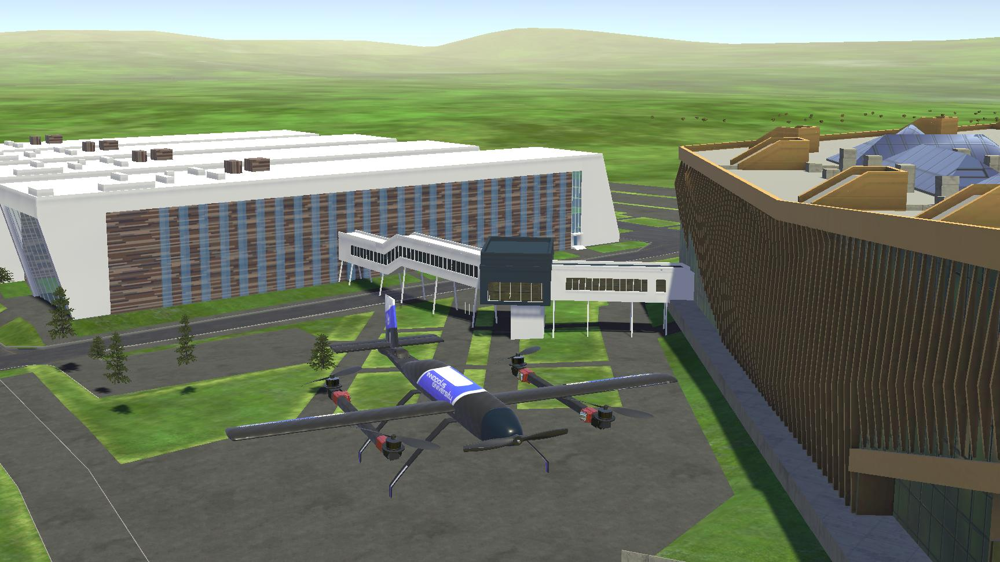

# Download Innopolis Simulator

Innopolis Simulator binaries are available here: https://github.com/inno-robolab/InnoSimulator
This package is an example of usage Innopolis Simulator for visual renderer and sensors simulation in couple with Gazebo as UAV dynamics source. Our own dynamics simulation module for VTOL plane would be published soon.


# Innopolis Simulator UAV Interface



## Innopolis Simulator UAV API

Innopolis Simulator is currently used as visual renderer and source of simulated sensor data. Dynamics simulation and control is carried outside. API is adapted for such usage.

Innopolis Simulator currently supports following API to control pose and actuators state of Innopolis VTOL UAV:

### To Simulator

ROS --> Sim

#### GPS Position
Topic name is `/sim/gps_position`.
Topic type is `sensor_msgs/NavSatFix`.

#### Orientation
Topic name is `/sim/attitude`.
Topic type is `geometry_msgs/QuaternionStamped`.

#### Actuators State
Topic name is `/sim/actuators`.
Topic type is `sensor_msgs/Joy`.

Axes in Joy message have following meaning:

1. FR, cw, rate, rpm (Front right motor speed)
2. RL, cw, rate, rpm (Rear left motor speed)
3. FL, ccw, rate, rpm (Front left motor speed)
4. RR, ccw, rate, rpm (Rear right motor speed)
5. aileron left, cw, deg
6. aileron right, cw, deg
7. elevator, cw, deg
8. rudder, cw, deg
9. thrust, pusher, rate, rpm

#### Gimbal
Topic name is `/sim/gimbal_angle`.
Topic type is `geometry_msgs/Vector3Stamped`.

- `vector.x` is roll in deg, 
- `vector.y` is pitch in deg, 
- `vector.z` is yaw in deg.

Roll, pitch and yaw values are global.

### From Simulator

Sim --> ROS

#### Camera

Topic name is `/sim/camera/compressed`.
Topic type is `sensor_msgs/CompressedImage`.


#### LIDAR

Topic name is `/sim/velodyne_points`.
Topic type is `sensor_msgs/PointCloud2`.

## Installation
Install PX4 and ROS according to [manual](https://dev.px4.io/master/en/setup/dev_env_linux_ubuntu.html) (`ubuntu_sim_ros_melodic.sh` bash script usage is recommended).

Install `rosbridge` from LGSVL:

```
roscd
cd ../src
git clone https://github.com/lgsvl/rosbridge_suite.git
catkin build
sudo apt-get install ros-melodic-rosauth
sudo apt-get install python-bson
sudo apt-get install python-protobuf
```


## Launch with Gazebo (PX4 SITL)

Run all:

```
roscd inno_sim_interface/scripts
scripts/run_all.sh
```

Kill:

`tmux kill-session -t innosim`

